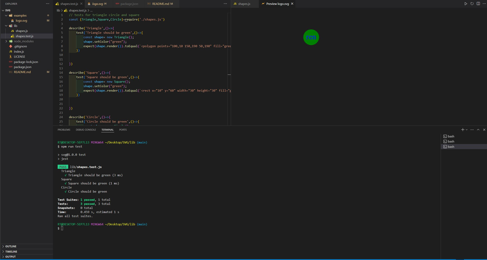

# SVG

## Description
This SVG logo generator was built to take in inputs in the termial and render an SVG.logo file in examples folder.

## Installation
Install node.js to start, then install the packages Inuirer and Jest via npm.

## Technologies
Javascript
npm inquirer
npm jest
nodeJs

## Usage
In your folder, right click on the index.js file and select "open in integrated terminal".  Once the terminal is open type in node index.js into the terminal and press enter to run.  Follow the prompts to add content to the SVG file that is being generated. Once all of the prompts are answered, if done correctly, an svg.logo file will be created in the examples folder. 

To use the tests, if Jest was imstalled correctly, the user can navigate to the shapes.test folder and open the integrated terminal for that file. Once 'npm run test' is entered in the terminal the test will run and the results of the test will be entered in the terminal.  

## License
Please see repository for licensing information

## Links

Github repository:
https://github.com/RTAKA808?tab=repositories

Link to demo video:
https://drive.google.com/file/d/1HKWSKV_ZnefHgE7fTbF0Citkuc_FVkDd/view

screenshot:

